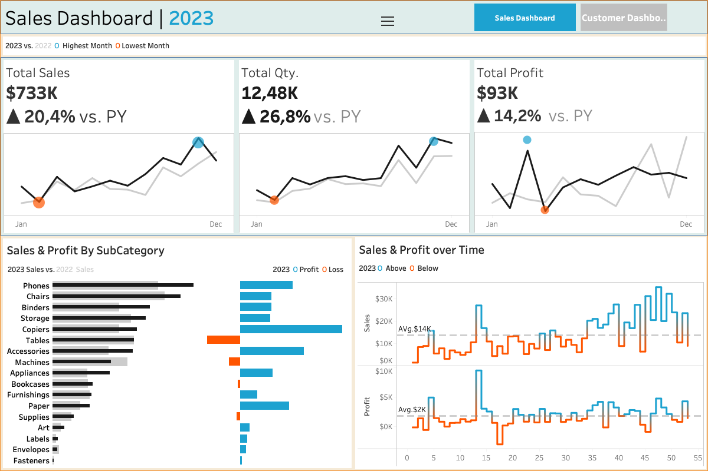

# Sales Dashboard

This repository hosts an interactive Sales Dashboard created using Tableau Desktop. The dashboard provides comprehensive insights into sales performance across various dimensions.

## Features
- **Interactive Visualizations:** Drill down into sales data by Total Sales, Sub-Category,Qunatity, Profit, and time period.
- **Dynamic Filters:** Customize views to focus on specific metrics.
- **Trend Analysis:** Identify sales trends and patterns over time.
- **Performance Metrics:** Track KPIs to evaluate and improve sales strategies.

## View the Dashboard
Access the interactive Sales Dashboard [here](https://username.github.io/sales-dashboard/).

## About the Creator
I am Aditya Thapa, a passionate data Scientist with expertise Data Science along with data visualization and business intelligence. Feel free to connect with me on [LinkedIn](www.linkedin.com/in/adityathapa45).
